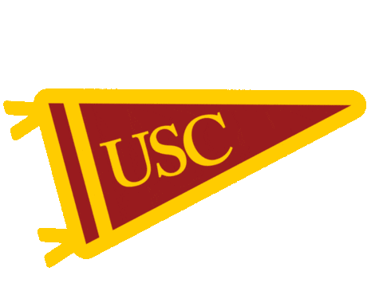

<H1> I'm Athashree !</H1>
<H3>I'm a Software Developer with an experience in developing web applications.</H3> 

- MS CS student at  
- Incoming SWE Intern at  for Summer 2022
- Interested in Software/Web Development
- Currently learning JavaScript Frameworks
- Fun/Weird Fact: I created y Github username in hurry and the first word I thought of was  (I'm a Big Bang Theory Fan).
<!--
**bazingaav/bazingaav** is a ✨ _special_ ✨ repository because its `README.md` (this file) appears on your GitHub profile.
Here are some ideas to get you started:

- 🔭 I’m currently working on ...
- 🌱 I’m currently learning ...
- 👯 I’m looking to collaborate on ...
- 🤔 I’m looking for help with ...
- 💬 Ask me about ...
- 📫 How to reach me: ...
- 😄 Pronouns: ...
- ⚡ Fun fact: ...
-->
